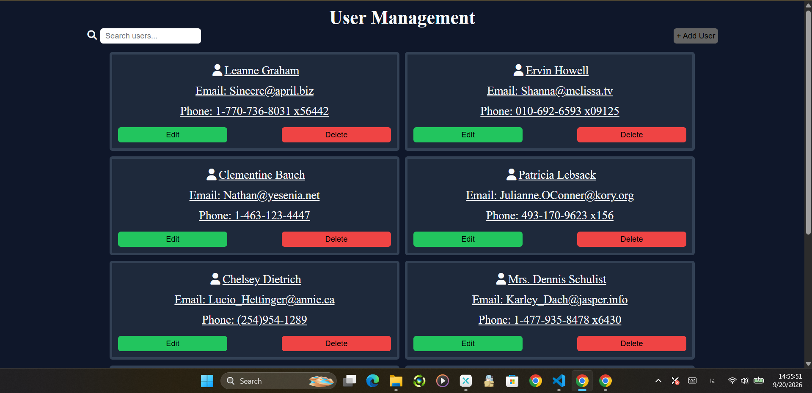
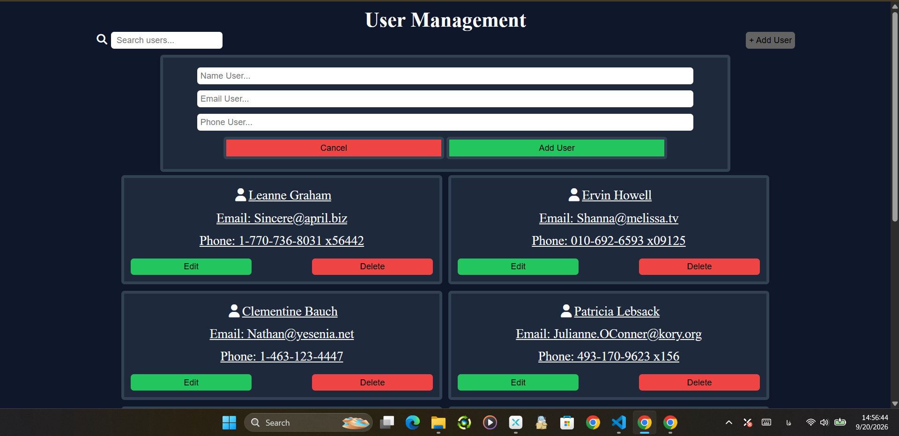

# 👥 User Management Dashboard

> **README Language:** English & فارسی
> This README provides the project documentation in both English and Persian.

A user management dashboard built with **HTML, CSS, and JavaScript**, created to practice core JavaScript concepts, CRUD operations, form validation, DOM manipulation, asynchronous JavaScript, and working with REST APIs.

---

## 🚀 Live Demo

🔗 **[View Live Demo](#)**

> The live demo link will be added after GitHub Pages is configured.

---

## 📸 Preview





---

## ✨ Features

* Fetch and display users from a REST API
* Search users by name, email, or phone number
* Add new users
* Edit existing users
* Delete users
* Form validation
* Prevent duplicate emails
* Prevent duplicate phone numbers
* API error handling
* Display error messages when users cannot be loaded
* Dynamic user rendering with JavaScript
* Responsive design

---

## 🛠️ Technologies

* HTML5
* CSS3
* JavaScript (ES6+)
* Fetch API
* REST API
* DOM Manipulation
* Async / Await
* Promises
* Regular Expressions

---

## 📚 JavaScript Concepts Practiced

This project was used to practice several JavaScript concepts, including:

* `fetch()`
* `async / await`
* `try / catch / finally`
* HTTP Methods:

  * `GET`
  * `POST`
  * `PATCH`
  * `DELETE`
* Arrays and Objects
* `map()`
* `filter()`
* `find()`
* `some()`
* `reduce()`
* DOM Manipulation
* Event Listeners
* Form Validation
* Regular Expressions
* Dynamic Template Rendering

---

## 🔌 API

This project uses **JSONPlaceholder** as a fake REST API for practicing CRUD operations.

JSONPlaceholder is a free fake REST API designed for testing, prototyping, and learning.

🔗 [JSONPlaceholder](https://jsonplaceholder.typicode.com/)

---

## 📂 Project Structure

```text
user-management-dashboard/
│
├── index.html
│
└── src/
    ├── css/
    │   └── style.css
    │
    └── js/
        └── app.js
```

---

## 🎯 Project Goal

The main goal of this project was to strengthen JavaScript skills by building a practical and interactive application.

The project focuses on:

* Working with external APIs
* Implementing CRUD operations
* Managing data with Arrays and Objects
* Building dynamic user interfaces with JavaScript
* DOM manipulation
* Handling asynchronous operations
* Form validation
* Error handling
* Writing reusable functions

---

## 👨‍💻 Author

**Sajad Avazpoor**

Frontend Developer focused on JavaScript and modern web development.

🔗 **GitHub:** [@sajadavazpwwr](https://github.com/sajadavazpwwr)

---

# 🇮🇷 نسخه فارسی

## 👥 داشبورد مدیریت کاربران

یک داشبورد مدیریت کاربران ساخته‌شده با **HTML، CSS و JavaScript** که با هدف تمرین مفاهیم اصلی JavaScript، عملیات CRUD، اعتبارسنجی فرم‌ها، کار با DOM، برنامه‌نویسی Asynchronous و کار با REST API توسعه داده شده است.

---

## 🚀 دمو آنلاین

🔗 **[مشاهده دمو آنلاین](#)**

> لینک دمو بعد از فعال‌سازی GitHub Pages اضافه خواهد شد.

---

## 📸 پیش‌نمایش


---

## ✨ امکانات

* دریافت و نمایش کاربران از REST API
* جستجوی کاربران بر اساس نام، ایمیل و شماره تلفن
* اضافه کردن کاربر جدید
* ویرایش اطلاعات کاربران
* حذف کاربران
* اعتبارسنجی فرم‌ها
* جلوگیری از ثبت ایمیل تکراری
* جلوگیری از ثبت شماره تلفن تکراری
* مدیریت خطاهای API
* نمایش پیام خطا در صورت عدم دریافت کاربران
* رندر کردن Dynamic کاربران با JavaScript
* طراحی Responsive

---

## 🛠️ تکنولوژی‌ها

* HTML5
* CSS3
* JavaScript (ES6+)
* Fetch API
* REST API
* DOM Manipulation
* Async / Await
* Promises
* Regular Expressions

---

## 📚 مفاهیم JavaScript تمرین‌شده

در این پروژه مفاهیم مختلف JavaScript به صورت عملی استفاده و تمرین شده‌اند:

* `fetch()`
* `async / await`
* `try / catch / finally`
* متدهای HTTP:

  * `GET`
  * `POST`
  * `PATCH`
  * `DELETE`
* کار با Array و Object
* `map()`
* `filter()`
* `find()`
* `some()`
* `reduce()`
* کار با DOM
* Event Listener
* اعتبارسنجی فرم
* Regular Expression
* ساخت Template به صورت Dynamic

---

## 🔌 API

این پروژه برای تمرین عملیات CRUD از **JSONPlaceholder** به عنوان یک REST API آزمایشی استفاده می‌کند.

JSONPlaceholder یک API آزمایشی رایگان است که برای یادگیری، تست و ساخت Prototype طراحی شده است.

🔗 [JSONPlaceholder](https://jsonplaceholder.typicode.com/)

---

## 📂 ساختار پروژه

```text
user-management-dashboard/
│
├── index.html
│
└── src/
    ├── css/
    │   └── style.css
    │
    └── js/
        └── app.js
```

---

## 🎯 هدف پروژه

هدف اصلی این پروژه تقویت مهارت‌های JavaScript از طریق ساخت یک پروژه کاربردی و تعاملی بوده است.

تمرکز اصلی پروژه روی موارد زیر بوده است:

* کار با APIهای خارجی
* پیاده‌سازی عملیات CRUD
* مدیریت داده‌ها با Array و Object
* ساخت رابط کاربری Dynamic با JavaScript
* کار با DOM
* مدیریت عملیات Asynchronous
* اعتبارسنجی اطلاعات ورودی
* مدیریت خطاها
* نوشتن توابع قابل استفاده مجدد

---

## 👨‍💻 سازنده

**Sajad Avazpoor**

Frontend Developer با تمرکز بر JavaScript و توسعه وب مدرن.

🔗 **GitHub:** [@sajadavazpwwr](https://github.com/sajadavazpwwr)

---

## 📄 License

This project was created for learning and portfolio purposes.

این پروژه با هدف یادگیری و استفاده در Portfolio ساخته شده است.
